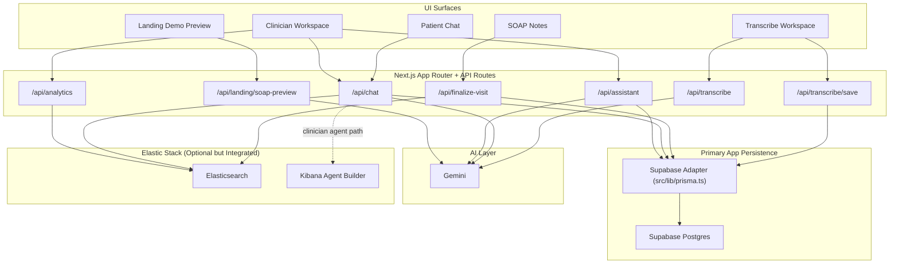
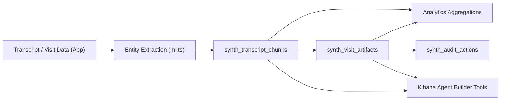
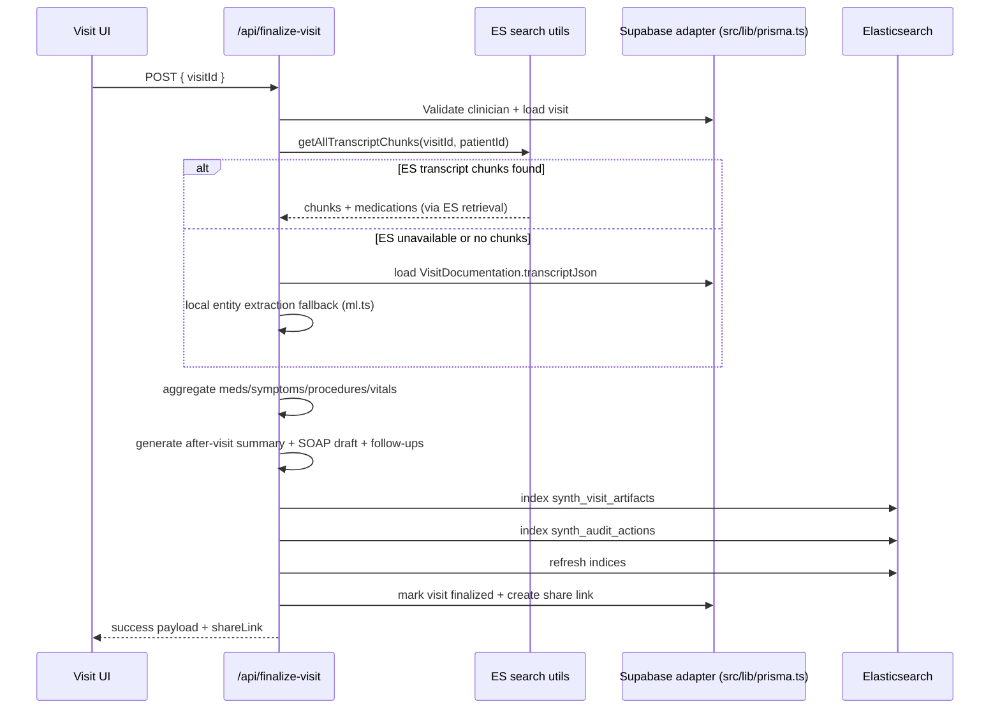
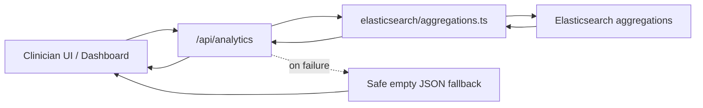
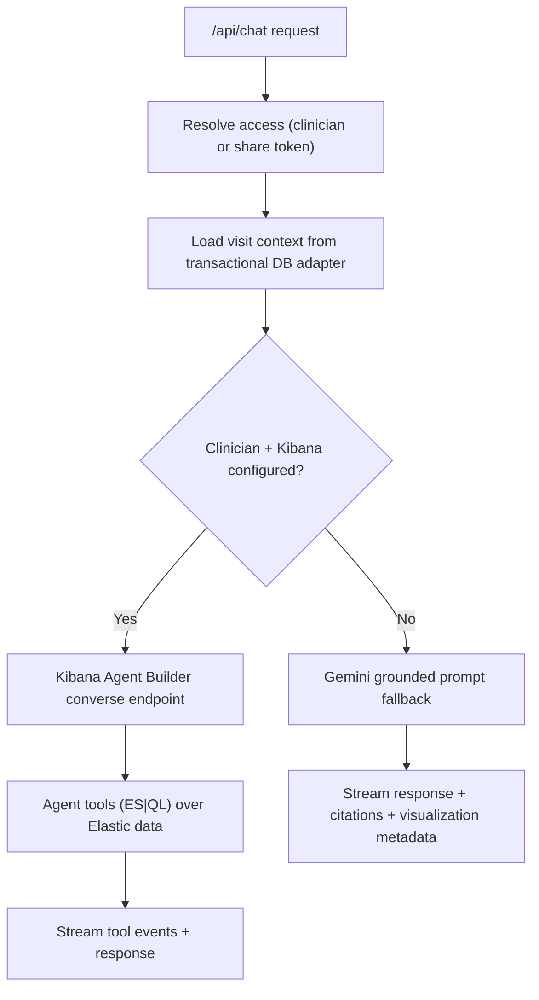
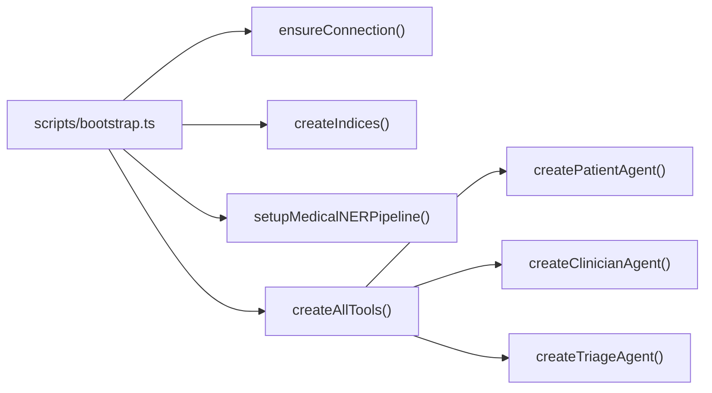

# Elasticsearch Integration Deep Dive (Synth)

## Purpose

This document is a dedicated technical explanation of how Elasticsearch is integrated into Synth, why it was chosen, what it enables, and where it adds complexity.

It is intentionally more detailed and more opinionated than the `README.md`.

Audience:

- maintainers
- backend engineers
- platform engineers
- reviewers evaluating the Elastic/Kibana investment

This document describes the current implementation in this repository and calls out tradeoffs honestly (not just the upside).

---

## Executive Summary

Synth uses Elasticsearch as a clinical intelligence layer, not just a search box.

What that means in practice:

- Supabase Postgres (via the compatibility layer in `src/lib/prisma.ts`) is the primary transactional system for users, visits, documentation, and share links.
- Elasticsearch stores retrieval-optimized transcript chunks and derived artifacts (summaries, SOAP drafts, follow-ups, audit logs).
- Kibana Agent Builder (optional) sits on top of Elasticsearch to execute ES|QL tools for agent workflows.
- The app has fallback paths so core workflows remain usable if Elastic/Kibana are unavailable.

### Best outcomes achieved by using Elasticsearch in this design

These are the strongest product/engineering outcomes enabled by the Elastic integration:

1. A single searchable corpus for transcript-level evidence and visit-level artifacts.
2. Retrieval patterns that are hard to do cleanly in a transactional DB alone (nested entity queries, timeline replay, text search, aggregations).
3. A clean path to agent tooling via ES|QL without duplicating data into another analytics/search store.
4. Fast feature reuse: the same indexed data supports chat grounding, analytics, and finalization artifacts.
5. Better observability and traceability through explicit audit action indexing.

### What Elasticsearch did not magically solve

Important reality check:

- It does not replace the transactional database.
- It adds schema/mapping maintenance burden.
- It adds operational overhead (connectivity, index migrations, bootstrap steps).
- It can complicate local development when the Elastic stack is not running.
- It does not eliminate the need for application-level fallback logic.

This repo handles those realities with a pragmatic hybrid architecture.

---

## Where Elasticsearch Fits In The Overall System

### High-Level System Topology

### Architectural Positioning (Important)

Synth is **not** Elasticsearch-only.

It is a layered design:

- Transactional correctness -> Supabase Postgres (accessed via the `src/lib/prisma.ts` compatibility layer)
- AI generation/transcription -> Gemini
- Retrieval/analytics/agent tooling -> Elasticsearch (+ Kibana Agent Builder)

That split is one of the reasons the system degrades gracefully in demo/local environments.

---

## Why Elasticsearch Was Used Here (And Why It Was Reasonable)

### Problem Shape

The repo needs to support data patterns that are awkward when forced into one storage model:

- ordered transcript replay by timestamp
- keyword and fuzzy lookup across transcript text
- structured entity lookup (medications/symptoms/procedures/vitals)
- aggregations across many visits
- audit events
- agent tool queries that need filtering + projection + sorting

A transactional DB can store the data, but retrieval and aggregations become harder or less ergonomic as features expand.

### Why Elasticsearch fit this use case

Elasticsearch gives Synth a useful combination:

- full-text search
- exact filtering (`keyword` fields)
- nested entity querying
- aggregations/histograms
- fast document retrieval patterns
- a natural integration path with Kibana and Agent Builder

### Why not only the transactional SQL database?

Even with Supabase Postgres as the transactional store, forcing all search/analytics/agent retrieval into SQL alone is still a poor fit for this app's goals.

Pain points if we forced everything into SQLite/Postgres-style transactional querying:

- transcript full-text + structured entity aggregation in one place becomes messy
- nested entity querying is less natural
- timeline retrieval + analytics + search all compete inside the same schema/query layer
- building agent tools on top of SQL alone is possible, but less aligned with the Kibana path used here

### Why not just use a hosted search API (Algolia/Meilisearch)?

Those tools are great for app search UX, but Synth also needs:

- structured/nested medical entity retrieval
- analytics aggregations
- custom artifact indexing
- audit logs
- Kibana Agent Builder integration

Elasticsearch is a better fit for the combined retrieval + analytics + tooling requirements.

### Why not OpenSearch?

OpenSearch could also work for many of these patterns.

This repo specifically integrates:

- `@elastic/elasticsearch`
- Kibana APIs
- Kibana Agent Builder workflows

So Elasticsearch + Kibana is the coherent pair in the current design.

---

## What Is Actually Integrated In Code (Not Hand-Wavy)

### Elasticsearch client and configuration guard

File: `src/lib/elasticsearch/client.ts`

Key implementation details:

- Reads `ELASTICSEARCH_URL` and optional `ELASTICSEARCH_API_KEY`
- Exposes `isElasticsearchConfigured()`
- Creates a real client when configured
- Exposes a proxy `esClient` that throws a clear error when Elastic is not configured

Why this matters:

- Call sites can fail fast with a meaningful error
- Fallback logic in routes can catch and degrade cleanly

### Index creation and mappings

File: `src/lib/elasticsearch/indices.ts`

What it does:

- Defines the `INDICES` constant
- Creates all required indices if they do not exist
- Applies mappings for transcript chunks, artifacts, audit events, analytics, and docs

This is not just a stub. It contains actual field-level mapping choices for the app's data model.

### Medical entity extraction

File: `src/lib/elasticsearch/ml.ts`

What it does today:

- Keyword/regex-driven entity extraction for:
  - medications
  - symptoms
  - procedures
  - vitals (BP/HR/temp)
- Red-flag symptom detection
- Optional ingest pipeline setup (`medical_ner_pipeline`) in Elasticsearch
- Helper to index transcript chunks with extracted entities

This is intentionally lightweight and deterministic. It gives structured output without requiring a heavier ML service in the loop.

### Transcript retrieval and medication lookup

File: `src/lib/elasticsearch/search.ts`

Key functions:

- `searchTranscript(...)`
- `getAllTranscriptChunks(...)`
- `getMedicationsFromVisit(...)`

These support both UI workflows and finalization logic.

### Aggregation-backed analytics

File: `src/lib/elasticsearch/aggregations.ts`

Key functions:

- `getVisitAnalytics()`
- `getMedicationPatternAnalysis(medicationName)`

These are exposed through `src/app/api/analytics/route.ts`.

### Kibana Agent Builder tools and agents

Files:

- `src/lib/kibana/client.ts`
- `src/lib/kibana/tools.ts`
- `src/lib/kibana/agents.ts`

This is a real integration layer, not documentation-only:

- tool definitions are created via Kibana APIs
- agents are created and configured with tool lists
- `/api/chat` can call the Agent Builder conversation endpoint when configured

---

## Data Model In Elasticsearch

### Index Inventory

| Index | Role | Main Consumers |
|---|---|---|
| `synth_transcript_chunks` | retrieval-ready transcript timeline + `ml_entities` | `/api/finalize-visit`, search utilities, Kibana tools |
| `synth_documents` | metadata and extracted text for supporting docs | future/agent use |
| `synth_visit_artifacts` | after-visit summary, SOAP draft, meds, follow-ups | analytics, agents, finalization workflows |
| `synth_audit_actions` | operational audit trail | compliance/ops/debugging |
| `synth_analytics` | aggregate snapshots (reserved/patterned) | analytics expansion |

### Elastic Data Flow (Conceptual)

### Mapping Strategy (Why these field types)

The mappings in `src/lib/elasticsearch/indices.ts` intentionally mix data shapes:

- `keyword`
  - exact filtering/grouping (`visit_id`, `patient_id`, names, types)
- `text`
  - transcript and note search (`text`, `soap_draft`, `after_visit_summary`)
- `nested`
  - entity arrays (`ml_entities.medications`, `symptoms`, `procedures`, `vitals`)
- `object`
  - flexible artifact payloads (`medication_list_json`, `followups_json`, `payload_json`)
- `date`
  - timeline and histogram queries

Why nested matters here:

- Medical entities are not flat tags only.
- Each item can carry subfields (dosage/frequency/confidence/etc.).
- Nested queries avoid false positives from cross-object field matching.

---

## End-to-End Flows That Use Elasticsearch

## 1) Visit Finalization (ES-first artifact path)

File: `src/app/api/finalize-visit/route.ts`

This is the most important Elastic-backed workflow in the repo.

### Finalization sequence

### Why this is a strong use of Elasticsearch

This route demonstrates the architectural value clearly:

- Elastic is used for retrieval and artifact persistence
- The Supabase-backed transactional layer remains the source of visit status and sharing/access state
- there is fallback logic, so the app does not become unusable when Elastic is absent

That balance is a good engineering result.

---

## 2) Analytics (aggregation-centric path)

Files:

- `src/lib/elasticsearch/aggregations.ts`
- `src/app/api/analytics/route.ts`

This path uses Elasticsearch the way it is strongest:

- aggregations on indexed artifacts/transcript-derived data
- time histograms
- bucket counts
- medication pattern analysis

### Analytics request path

Why this matters:

- The API remains stable even if Elastic is down.
- UI can still render empty states rather than fail hard.

---

## 3) Chat and Agent Tooling (Elastic + Kibana path)

File: `src/app/api/chat/route.ts`

There are two runtime paths:

- Kibana Agent Builder path (clinician + configured Kibana)
- Gemini fallback path (all other cases / failures)

### Chat runtime decision path

Why Elasticsearch helps here:

- Agent tools query the same indexed corpus used elsewhere.
- Transcript search and artifact retrieval become tool-level primitives.
- You avoid building a separate bespoke retrieval service for the agent layer.

---

## 4) Bootstrap and Provisioning

File: `scripts/bootstrap.ts`

This script operationalizes the Elastic/Kibana integration.

What it does:

1. Checks Elasticsearch connection
2. Creates indices
3. Registers the medical NER ingest pipeline
4. Creates Agent Builder tools
5. Creates 3 agents (patient/clinician/triage)

### Bootstrap dependency flow

This is a strong point in the implementation: the integration is reproducible, not just manually configured.

---

## Why Elasticsearch Was Better Than The Alternatives (In This Project)

This section is intentionally balanced.

## Alternatives considered (pragmatic comparison)

| Option | What It Would Be Good At | Where It Falls Short for Synth |
|---|---|---|
| Prisma + SQLite only | simplicity, local dev, transactions | weak fit for transcript search + nested entities + aggregations + agent tooling |
| Postgres + FTS | strong transactional base + decent text search | more custom work for nested entity analytics and the Kibana/Agent Builder path |
| Algolia / Meilisearch | fast app search UX | not ideal for structured clinical artifact analytics + audit + ES|QL tooling |
| OpenSearch | similar search/agg capabilities | current repo already targets Elastic + Kibana APIs |
| Vector DB only | semantic retrieval | weaker fit for exact clinical filters, timelines, nested entity aggregations, audit trails |

### What we specifically liked about Elasticsearch here

1. **One engine for search + aggregations**
   - Synth needed both, and Elastic handles both well.

2. **Nested entities**
   - This matters for medications/vitals/procedures.

3. **Kibana adjacency**
   - Tooling and agent orchestration integrate naturally with the chosen stack.

4. **Flexible document model**
   - Useful for evolving artifact payloads (`followups_json`, `payload_json`).

5. **Operationally well-known**
   - Lots of established patterns for indexing, mappings, aggregations, and observability.

### What we did not love (and should be honest about)

1. **Mapping complexity**
   - Easy to get wrong early.
   - Field type mistakes become painful later.

2. **Bootstrap overhead**
   - Developers need an extra stack running for full functionality.

3. **Index lifecycle / schema evolution**
   - Requires more operational discipline than pure app DB changes.

4. **Nested query mental load**
   - Powerful but not beginner-friendly.

5. **Partial feature mode complexity**
   - Since Elastic is optional, app code needs explicit fallbacks and test coverage for both modes.

These are real costs, and the current repo handles them reasonably but not perfectly.

---

## Best Results Achieved By Using Elasticsearch (Concrete, Not Marketing)

This section avoids invented benchmark numbers and focuses on engineering/product outcomes visible in the implementation.

### 1) Reusable clinical intelligence layer

The same indexed corpus powers:

- transcript search
- medication extraction lookup
- visit artifact retrieval
- analytics
- agent tools

That reuse is a major architectural win.

### 2) Better traceability than pure generative workflows

Because artifacts and audit actions are indexed, the system is not just:

- \"AI prompt in\"
- \"answer out\"

It has persistent, queryable intermediate outputs and actions.

This is especially valuable for debugging and reviewing clinical workflow automation.

### 3) Degraded mode without total failure

The app can continue functioning in reduced mode if Elastic is unavailable:

- finalization can rebuild from the transactional `VisitDocumentation.transcriptJson` record
- analytics returns safe empty payloads
- chat can use Gemini fallback

This preserves usability while still benefiting from Elastic when available.

### 4) Natural agent tool model

The Elastic + Kibana path gives a coherent tooling story:

- index data once
- expose ES|QL tools
- attach tools to agents

That is cleaner than building a one-off tool backend for each agent capability.

### 5) Clear expansion path

The current design supports future improvements without major architectural replacement:

- richer entities
- better aggregations
- more artifact types
- document ingestion pipelines
- alerting / anomaly-style analytics

---

## What Could Be Better (If We Continue Investing Here)

This section is intentionally critical so the document stays practical.

### 1) Stronger mapping versioning and migrations

Current state:

- bootstrap creates indices if missing

What is missing for maturity:

- index versioning (e.g., `synth_transcript_chunks_v2`)
- alias-based cutover
- reindex scripts

### 2) Better typing between app code and ES documents

There are typed wrappers, but some paths still require casting (`unknown as ...`) around search result shapes.

Improvement options:

- shared typed document schemas
- runtime validation (e.g., zod) on ES reads
- stricter indexing adapters

### 3) More explicit index write/read ownership boundaries

Today the repo is pragmatic and compact. As the app grows, separating:

- ingestion writers
- analytics readers
- agent retrieval readers

would reduce coupling.

### 4) More realistic NER pipeline

Current extraction in `ml.ts` is intentionally lightweight and keyword/regex-driven.

That is good for local/dev/demo reliability, but limited for production-grade extraction quality.

Future paths:

- hybrid deterministic + model-assisted extraction
- confidence calibration
- validation against clinician edits

### 5) Testing both Elastic and non-Elastic modes

The code supports degraded mode, which is good.
To make it robust long-term, tests should explicitly cover:

- Elastic configured and healthy
- Elastic missing
- Elastic present but query/index failure
- Kibana present vs absent

---

## Integration Verification Checklist (For Maintainers)

Use this checklist after changes to the Elastic integration.

### App-level checks

- `npm run lint`
- `npx tsc --noEmit`
- `npm run build`

### Elastic configuration checks

- `ELASTICSEARCH_URL` set
- `ELASTICSEARCH_API_KEY` set (if required by cluster)
- `npm run bootstrap` succeeds

### Functional checks

- create new visit (`/clinician/new-visit`)
- transcribe/save a visit (`/transcribe`)
- finalize visit (`/api/finalize-visit`)
- analytics endpoint returns data or safe fallback (`/api/analytics`)
- chat works with fallback if Kibana unavailable

### Kibana checks (optional path)

- `KIBANA_URL`, `KIBANA_API_KEY`, `KIBANA_SPACE_ID` configured
- tools created in Agent Builder
- agents created in Agent Builder
- clinician `/api/chat` path can reach Agent Builder endpoint

---

## Practical Guidance: When To Use Elasticsearch In This App (And When Not To)

Use Elasticsearch when:

- you need transcript/entity retrieval
- you need aggregations across visits
- you are building agent tools over clinical artifacts
- you need audit/searchable derived outputs

Do not force Elasticsearch when:

- the data is purely transactional (auth, share links, visit ownership checks)
- you need strict relational integrity
- the feature is simple CRUD with no retrieval/aggregation needs

That split keeps the architecture sane.

---

## Final Assessment (Balanced)

Elasticsearch is a good fit for Synth's retrieval + analytics + agent-tooling requirements.

The strongest design choice in this repo is not just \"using Elasticsearch\". It is the combination of:

- meaningful Elastic integration where it helps
- Supabase Postgres (through the `src/lib/prisma.ts` compatibility layer) as a stable transactional core
- explicit fallback behavior when Elastic/Kibana are absent

That gives the project both:

- a strong advanced mode (Elastic/Kibana enabled)
- a usable demo/dev mode (fallbacks)

The main downside is added operational and schema complexity, which is real and should continue to be managed deliberately.

---

## File Reference Index (Quick Jump)

- `scripts/bootstrap.ts`
- `src/lib/elasticsearch/client.ts`
- `src/lib/elasticsearch/indices.ts`
- `src/lib/elasticsearch/ml.ts`
- `src/lib/elasticsearch/search.ts`
- `src/lib/elasticsearch/aggregations.ts`
- `src/lib/kibana/client.ts`
- `src/lib/kibana/tools.ts`
- `src/lib/kibana/agents.ts`
- `src/app/api/finalize-visit/route.ts`
- `src/app/api/analytics/route.ts`
- `src/app/api/chat/route.ts`
