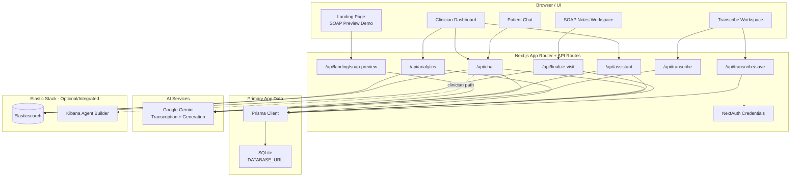
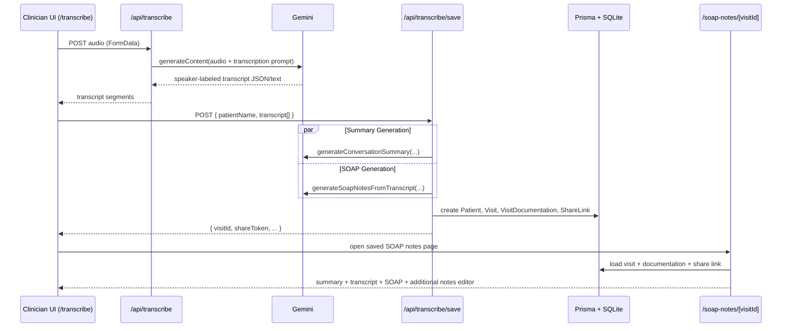
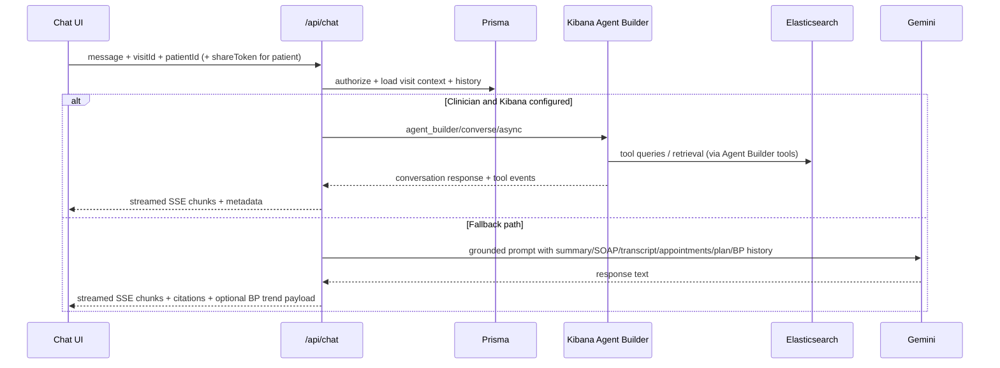
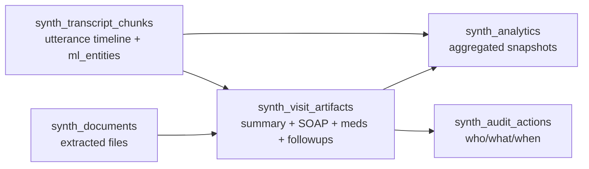
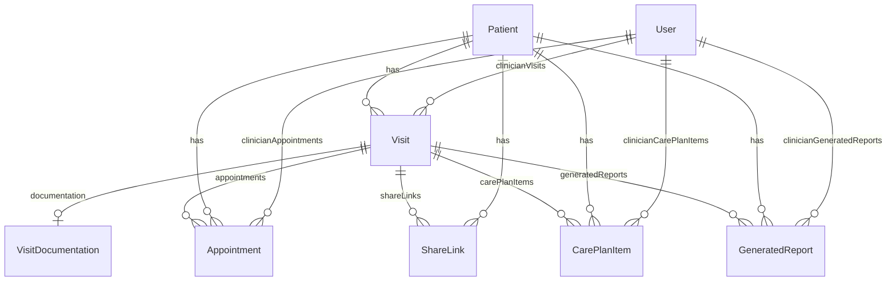

# Synth

<p align="center">
  
</p>

<p align="center"><strong>AI-powered clinical visit workflow platform built on Next.js, Prisma, Gemini, and an Elasticsearch/Kibana clinical intelligence layer.</strong></p>

<p align="center">
  <code>Next.js 16</code> | <code>React 19</code> | <code>TypeScript</code> | <code>Prisma + SQLite</code> | <code>Gemini</code> | <code>Elasticsearch</code> | <code>Kibana Agent Builder</code>
</p>

---

## What Synth Does

Synth turns clinician-patient conversations into structured clinical outputs and makes them usable across the full workflow:

- real-time / recorded transcription
- AI-generated visit summary + SOAP notes
- clinician workspace and queue views
- patient-safe chat grounded in visit evidence
- blood pressure trend extraction + visualization
- Elasticsearch-backed analytics and retrieval
- optional Kibana Agent Builder tool/agent orchestration

Synth is designed so the application still works without Elasticsearch/Kibana (fallback paths exist), but Elastic is deeply integrated and powers the richest search/analytics/agent features.

---

## Architecture At A Glance

### System Diagram



### Core Workflow Sequence (Transcribe -> Save -> SOAP)



### Chat Runtime (Kibana Agent Builder + Gemini Fallback)



---

## Integration Map (What Is Actually Integrated)

### Primary Integrations

| Integration | Status in Code | Purpose | Key Files |
|---|---|---|---|
| NextAuth (Credentials) | Required | clinician auth/session | `src/lib/auth.ts`, `src/app/api/auth/[...nextauth]/route.ts` |
| Prisma + SQLite | Required | core app persistence | `prisma/schema.prisma`, `src/lib/prisma.ts` |
| Google Gemini | Required for AI features | audio transcription + summaries + SOAP + assistant fallback | `src/lib/gemini.ts`, `src/app/api/transcribe/route.ts`, `src/lib/clinical-notes.ts` |
| Elasticsearch | Optional but deeply integrated | transcript retrieval, visit artifacts, analytics, audit log | `src/lib/elasticsearch/*`, `src/app/api/finalize-visit/route.ts`, `src/app/api/analytics/route.ts`, `src/app/api/chat/route.ts` |
| Kibana Agent Builder | Optional | clinician agent orchestration and tools | `src/lib/kibana/*`, `scripts/bootstrap.ts`, `src/app/api/chat/route.ts` |

### Non-Backend Supabase Usage

Supabase appears in this repo as **public image asset hosting URLs** used by landing/login/marketing visuals.
It is **not** the primary database/auth/backend in the current implementation.

---

## Elasticsearch Integration (Technical Deep Dive)

Synth does not treat Elasticsearch as a sidecar search plugin. It is integrated as a clinical intelligence subsystem that stores derived artifacts, retrieval-ready transcript chunks, and audit events.

### Index Topology

Provisioned in `src/lib/elasticsearch/indices.ts` (via `scripts/bootstrap.ts`):

- `synth_transcript_chunks`
- `synth_documents`
- `synth_visit_artifacts`
- `synth_audit_actions`
- `synth_analytics`

### Elastic Data Model (Conceptual)



### Why Elastic Is Used Here (Not Just Mentioned)

#### 1) Transcript Retrieval + Search

`src/lib/elasticsearch/search.ts` implements:

- `searchTranscript(...)`
  - multi-match query on transcript `text`
  - fuzzy matching
  - highlighted snippets
- `getAllTranscriptChunks(...)`
  - full chronological replay of a visit transcript
- `getMedicationsFromVisit(...)`
  - nested extraction over `ml_entities.medications`

This supports exact visit replay, keyword search, and entity-level lookup.

#### 2) Visit Finalization Artifact Storage

`src/app/api/finalize-visit/route.ts`:

- loads transcript chunks (ES first, Prisma fallback)
- aggregates symptoms/procedures/vitals/meds
- generates final artifacts (after-visit summary, SOAP draft, follow-ups)
- writes to `synth_visit_artifacts`
- writes audit events to `synth_audit_actions`
- refreshes indices for immediate queryability

#### 3) Analytics Aggregations

`src/lib/elasticsearch/aggregations.ts` + `src/app/api/analytics/route.ts`:

- total visit cardinality
- top medication buckets
- top symptom buckets
- visits-over-time histogram
- medication dosage pattern analysis + unique patient counts

#### 4) Kibana Agent Builder Tooling

`src/lib/kibana/tools.ts` defines ES|QL tools (examples):

- visit summary retrieval
- medication retrieval
- transcript search
- timeline retrieval
- follow-up retrieval
- symptom retrieval

These tools are bound to agents created in `src/lib/kibana/agents.ts`.

### Elastic Resilience Strategy (Important)

The app remains usable when Elastic is unavailable:

- `/api/finalize-visit` can fall back to Prisma-stored transcript JSON + local entity extraction
- `/api/analytics` returns safe empty payloads on failure
- `/api/chat` falls back to Gemini-grounded responses when Kibana/Elastic agent path is unavailable

This is intentional and useful for local demos, partial deployments, and degraded mode operation.

---

## Data Model (Prisma / SQLite)

`prisma/schema.prisma` uses SQLite in the current implementation.

### ER Diagram (Simplified)



### Core Tables

- `User` (credentials auth + role)
- `Patient`
- `Visit`
- `VisitDocumentation` (transcript JSON + summary + SOAP + additional notes)
- `ShareLink` (patient access token)
- `Appointment`
- `CarePlanItem`
- `GeneratedReport`

---

## AI Integration (Gemini)

### Where Gemini Is Used

- `src/app/api/transcribe/route.ts`
  - audio transcription into speaker-labeled segments
- `src/lib/clinical-notes.ts`
  - conversation summary generation
  - SOAP note generation
  - fallback non-AI generators if Gemini fails
- `src/app/api/landing/soap-preview/route.ts`
  - landing-page transcript/audio preview generation
- `src/app/api/chat/route.ts`
  - chat response generation fallback (grounded prompt over visit context)
- `src/app/api/assistant/route.ts`
  - clinician dashboard assistant (with deterministic fallback)

### Fallback Behavior (Important for Demos)

#### Transcribe page fallback
If server transcription fails:

- browser live transcript is used to build transcript segments
- user sees a warning to review before saving
- saving still works

#### SOAP generation fallback
If Gemini fails in `src/lib/clinical-notes.ts`:

- summary and SOAP use deterministic fallback generators
- app still persists visit documentation

#### Assistant/chat fallback
If Gemini or Kibana path fails:

- deterministic text fallbacks are used where implemented
- navigation and basic guidance still work

---

## Feature Matrix (Current App)

### Landing Page Demo (`/`)

- transcript paste/file upload -> parsed transcript + summary + SOAP preview
- audio upload -> Gemini transcription + summary + SOAP preview (requires `GEMINI_API_KEY`)
- no login required for preview mode
- preview only (no persistence)

### Clinician Workspace (`/clinician`)

- real visit metrics (from `/api/visits`)
- queue and workflow cards
- AI composer (`/api/assistant`)
- safe empty states when no visits exist

### Transcribe (`/transcribe`)

- browser microphone recording
- live transcript via browser SpeechRecognition (when available)
- server transcription via `/api/transcribe`
- save-to-visit via `/api/transcribe/save`
- smooth fallback if server transcription unavailable

### Visit Detail (`/visit/[visitId]`)

- transcript review
- entity chips
- finalize visit action (`/api/finalize-visit`)
- ES-first, Prisma fallback transcript load

### SOAP Notes (`/soap-notes`, `/soap-notes/[visitId]`)

- saved records list
- detailed summary + SOAP + transcript
- additional notes editor
- patient share link generation

### Patient Chat (`/patient/[shareToken]`)

- share-token access
- patient-safe grounded chat over visit data
- citations/source metadata
- BP trend chart metadata support in chat responses

---

## API Surface (Operationally Important Endpoints)

### Core Workflow APIs

| Endpoint | Auth | Purpose |
|---|---|---|
| `POST /api/transcribe` | clinician | audio -> transcript segments (Gemini) |
| `POST /api/transcribe/save` | clinician | persist visit + docs + share link |
| `POST /api/finalize-visit` | clinician | finalize visit, generate artifacts, index into Elastic |
| `POST /api/landing/soap-preview` | public | transcript/audio demo preview -> summary + SOAP |

### Documentation / Chat / Assistant

| Endpoint | Auth | Purpose |
|---|---|---|
| `GET /api/visits` | clinician | clinician visit list |
| `POST /api/visits` | clinician | create draft visit |
| `POST /api/chat` | clinician/patient-share | grounded chat, optional Kibana path |
| `POST /api/assistant` | clinician/guest guidance | in-app assistant + navigation intent |
| `GET /api/analytics` | clinician | analytics over Elastic (safe fallback) |

### SOAP Actions (per visit)

- `POST /api/soap-actions/[visitId]/appointments`
- `POST /api/soap-actions/[visitId]/plan-items`
- `POST /api/soap-actions/[visitId]/report`
- `GET/PATCH /api/soap-notes/[visitId]`

---

## Project Structure (Key Files)

```text
prisma/
  schema.prisma                # SQLite schema (users, visits, docs, share links, tasks, reports)
  seed.ts                      # seeds clinician login only (no demo visits/notes)

scripts/
  bootstrap.ts                 # Elastic + Kibana bootstrap (indices, pipeline, tools, agents)

src/
  app/
    api/
      transcribe/route.ts      # Gemini audio transcription
      transcribe/save/route.ts # persist transcript + summary + SOAP
      finalize-visit/route.ts  # generate artifacts + Elastic indexing
      chat/route.ts            # patient/clinician chat (Kibana + Gemini fallback)
      assistant/route.ts       # clinician dashboard assistant
      analytics/route.ts       # Elastic aggregations
      landing/soap-preview/route.ts # landing page preview pipeline
    clinician/
    transcribe/
    soap-notes/
    visit/[visitId]/
    patient/[shareToken]/

  lib/
    clinical-notes.ts          # summary/SOAP generation (+ fallback generators)
    gemini.ts                  # Gemini client initialization
    auth.ts                    # NextAuth credentials config
    prisma.ts                  # Prisma client singleton
    elasticsearch/
      client.ts                # ES client setup
      indices.ts               # index mappings + create flow
      ml.ts                    # medical entity extraction / pipeline utilities
      search.ts                # transcript + medication retrieval
      aggregations.ts          # analytics aggregations
    kibana/
      client.ts                # Kibana API wrapper
      tools.ts                 # Agent Builder tool definitions
      agents.ts                # patient/clinician/triage agents
```

---

## Setup (Local Development)

### Prerequisites

- Node.js 20+
- npm
- (Optional but recommended) Elasticsearch + Kibana if you want full Elastic/Kibana features
- Gemini API key for AI features

### 1) Install

```bash
npm install
```

### 2) Configure environment

```bash
copy .env.example .env
```

Populate `.env`:

```env
DATABASE_URL="file:./dev.db"
NEXTAUTH_SECRET=...
NEXTAUTH_URL=http://localhost:3000
GEMINI_API_KEY=...

# Optional / Elastic features
ELASTICSEARCH_URL=...
ELASTICSEARCH_API_KEY=...
KIBANA_URL=...
KIBANA_API_KEY=...
KIBANA_SPACE_ID=default

NEXT_PUBLIC_APP_URL=http://localhost:3000
```

### 3) Initialize Prisma

```bash
npm run prisma:generate
npm run prisma:migrate
npm run prisma:seed
```

### 4) (Optional) Bootstrap Elastic + Kibana Agent Builder

```bash
npm run bootstrap
```

This script:

- checks Elasticsearch connectivity
- creates Synth indices
- registers medical NER pipeline
- creates Kibana Agent Builder tools
- creates Synth agents (`patient`, `clinician`, `triage`)

### 5) Run the app

```bash
npm run dev
```

Open: `http://localhost:3000`

---

## Default Seed Credentials (No Demo Visit Data)

The seed creates **only a clinician user**, not demo patients/visits.

- Email: `admin@synth.health`
- Password: `synth2025`
- Role: `clinician`

This means you can verify empty-state behavior and create visits from scratch.

---

## Development / Verification Commands

```bash
npm run lint
npx tsc --noEmit
npm run build
```

These are the key checks used to verify integration stability after changes.

---

## Deployment Notes / Operational Behavior

### Optional integrations and fallback modes

- **No Elasticsearch/Kibana:** app still supports core visit creation, transcription save, SOAP workflows, and chat fallback paths.
- **No Gemini:** many AI features degrade or fail (audio transcription and AI generation require `GEMINI_API_KEY`), but some deterministic fallbacks exist for summary/SOAP and assistant behavior.
- **No browser SpeechRecognition:** recording still captures audio, but live transcript preview may be unavailable until server transcription returns.

### Security and access model

- Clinician routes require NextAuth credentials session
- Patient chat uses share-token access (`ShareLink`)
- `/api/chat` validates clinician ownership or matching share token before serving visit-grounded responses

---

## Troubleshooting

### "Server transcription was unavailable... browser live transcript was used"

This is **not a Supabase issue**.

It indicates the server-side transcription path (Gemini via `/api/transcribe`) failed, and the app fell back to browser live transcript capture.

Common causes:

- missing/invalid `GEMINI_API_KEY`
- Gemini quota/rate limits
- network/API error
- auth/session issue causing `/api/transcribe` failure

### Elasticsearch/Kibana features not working

Check:

- `ELASTICSEARCH_URL` / `ELASTICSEARCH_API_KEY`
- `KIBANA_URL` / `KIBANA_API_KEY`
- `npm run bootstrap` completed successfully
- Kibana space value (`KIBANA_SPACE_ID`) matches your deployment

---

## License

This project is licensed under the MIT License.
See `LICENSE` for the full text.

---

## MIT License (Full Text)

```text
MIT License

Copyright (c) 2026 Manoj7ar

Permission is hereby granted, free of charge, to any person obtaining a copy
of this software and associated documentation files (the "Software"), to deal
in the Software without restriction, including without limitation the rights
to use, copy, modify, merge, publish, distribute, sublicense, and/or sell
copies of the Software, and to permit persons to whom the Software is
furnished to do so, subject to the following conditions:

The above copyright notice and this permission notice shall be included in all
copies or substantial portions of the Software.

THE SOFTWARE IS PROVIDED "AS IS", WITHOUT WARRANTY OF ANY KIND, EXPRESS OR
IMPLIED, INCLUDING BUT NOT LIMITED TO THE WARRANTIES OF MERCHANTABILITY,
FITNESS FOR A PARTICULAR PURPOSE AND NONINFRINGEMENT. IN NO EVENT SHALL THE
AUTHORS OR COPYRIGHT HOLDERS BE LIABLE FOR ANY CLAIM, DAMAGES OR OTHER
LIABILITY, WHETHER IN AN ACTION OF CONTRACT, TORT OR OTHERWISE, ARISING FROM,
OUT OF OR IN CONNECTION WITH THE SOFTWARE OR THE USE OR OTHER DEALINGS IN THE
SOFTWARE.
```

